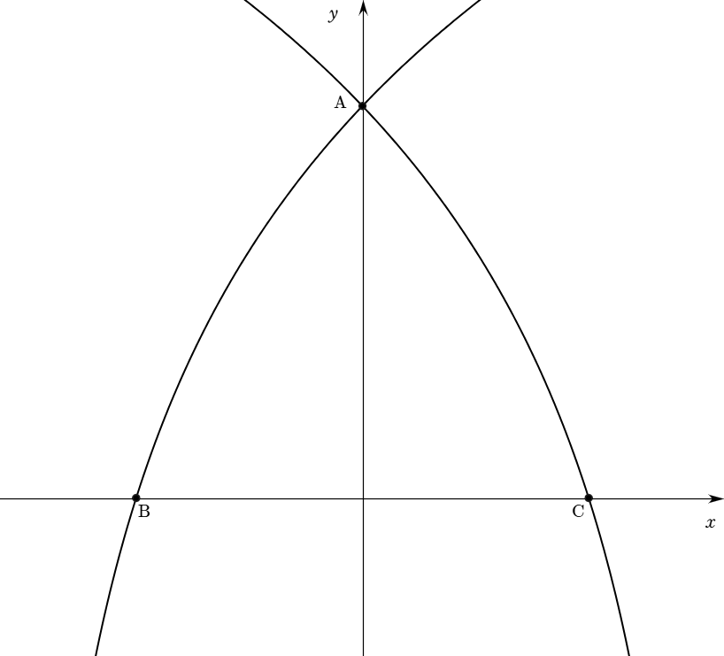

</img>

곡선 $\displaystyle y = \log_{a}(x + 3)$이 곡선
$\displaystyle y = \log_{a}( - x + 3)$는 서로 $\displaystyle x$축 대칭
관계이다.

따라서 두 곡선은 $\displaystyle y$축, 즉 $\displaystyle x = 0$일 때
만나므로 점 $\displaystyle \mathrm{A}$의 좌표는 $\displaystyle (0,\log_{a}3)$

곡선 $\displaystyle y = \log_{a}(x + 3)$은 $\displaystyle x = - 2$일 때
$\displaystyle x$축과 만나므로 점 $\displaystyle \mathrm{B}$의 좌표는
$\displaystyle ( - 2, 0)$

곡선 $\displaystyle y = \log_{a}( - x + 3)$이 $\displaystyle x = 2$일 때
$\displaystyle x$축과 만나므로 점 $\displaystyle \mathrm{C}$의 좌표는
$\displaystyle (2, 0)$

$\displaystyle \overline{\mathrm{BC}} = 4$이므로 삼각형 $\displaystyle \mathrm{ABC}$의
넓이를 $\displaystyle S$라 두면

$\displaystyle S = \frac{1}{2} \times$(밑변)$\displaystyle \times$(높이)$\displaystyle =$$\displaystyle \frac{1}{2} \times 4 \times \log_{a}3$

$\displaystyle S = \frac{\sqrt{3}}{4} \times$(변의
길이)$\displaystyle {}^{2}$$\displaystyle = \frac{\sqrt{3}}{4} \times 4^{2} = 4\sqrt{3}$

따라서
$\displaystyle \frac{1}{2} \times 4 \times \log_{a}3 = 4\sqrt{3}$에서
$\displaystyle \log_{a}3 = 2\sqrt{3}$이다.

로그를 지수로 바꾸면 $\displaystyle a^{2\sqrt{3}} = 3$이므로
$\displaystyle a = 3^{\frac{1}{2\sqrt{3}}} = 3^{\frac{\sqrt{3}}{6}}$이다.
